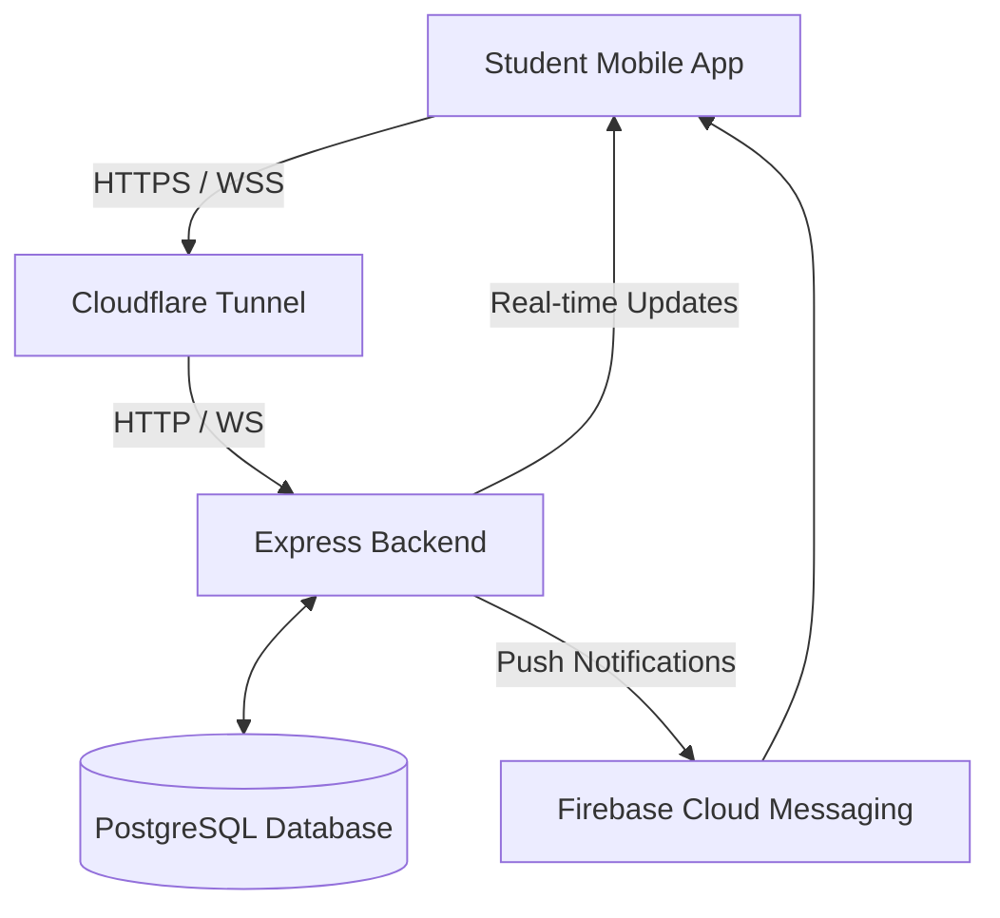

# Qrono — University Laboratory Attendance System

**Qrono** is a modern, full-stack attendance management system specifically designed for university laboratories. It leverages time-limited, cryptographically signed QR codes and Cloudflare tunneling to provide a secure, wireless, and cross-platform experience for students, professors, and administrators.

---

## 📖 Project Overview

Qrono addresses the challenges of traditional attendance tracking in academic environments. By using dynamic QR codes, it prevents "buddy check-ins" and ensures that students are physically present during their assigned lab sessions. The system is designed to work seamlessly across local networks and the public internet via Cloudflare Tunnel, making it highly accessible without compromising security.

### Core Value Proposition
- **Security:** Signed QR tokens prevent forgery and replay attacks.
- **Accessibility:** Cloudflare Tunnel enables wireless check-ins from any network.
- **Transparency:** Real-time dashboards for all roles provide instant visibility into attendance status.
- **Automation:** Automated session scheduling and notification systems reduce administrative overhead.

---

## 🚀 Key Features

### 👨‍🎓 For Students
- **Wireless QR Check-in:** Scan professor-generated QR codes to instantly record attendance.
- **Attendance History:** View a personalized log of all past lab attendances.
- **Real-time Notifications:** Receive instant alerts when a session starts or when attendance is recorded.
- **Wireless Mode:** Easy configuration to switch between local and remote (tunnel) backend access.

### 👨‍🏫 For Professors
- **Dynamic QR Generation:** Create secure, time-limited QR codes for active sessions.
- **Manual Attendance:** Mark students present manually if they lack a device or encounter issues.
- **Session Management:** Create, view, and manage lab sessions in real-time.
- **Attendance Reports:** View comprehensive attendance lists for each session.
- **Unauthorized Access Logs:** Monitor and receive alerts for failed scan attempts (e.g., wrong group, expired code).

### 🔑 For Admins
- **User & Role Management:** Manage accounts for students, professors, and other admins.
- **Academic Structure:** Define laboratories, student groups, and departments.
- **Global Statistics:** Monitor attendance trends across the entire institution.
- **Schedule Management:** Oversee and manage recurring session schedules.

---

## 🛠 Tech Stack

| Layer | Technology | Key Libraries |
| :--- | :--- | :--- |
| **Backend** | Node.js (Express.js) | Prisma ORM, Socket.IO, JWT, Firebase Admin |
| **Frontend** | Flutter (Dart) | Provider, Socket.IO Client, Mobile Scanner, Easy Localization |
| **Database** | PostgreSQL | — |
| **DevOps** | Shell/Batch Scripts | Cloudflared (Tunneling), GitHub Actions (CI) |
| **Infrastructure** | Cloudflare Tunnel | Secure public access to localhost |

---

## 🏗 Architecture



---

## 📊 Database Schema (Prisma)

The system uses a relational schema optimized for academic workflows:

- **Users & Profiles:** Multi-tenant architecture with separate profiles for `Student`, `Professor`, and `Admin`.
- **Sessions:** The central unit of work, linking a `Professor`, `Group`, `Laboratory`, and `Schedule`.
- **Attendance:** Records the relationship between a `Student` and a `Session`, including check-in time and method (QR or Manual).
- **QR Codes:** Tracks generated tokens, their validity window, and revocation status.
- **Unauthorized Logs:** Captures failed scan attempts for security auditing.
- **Exclusions:** Allows professors to exclude specific students from certain courses.

---

## 📁 Project Structure

```text
Qrono/
├── backend/                  # Node.js API with Express & Prisma
│   ├── prisma/               # Schema definitions and database migrations
│   ├── src/
│   │   ├── controllers/      # Request handlers (logic)
│   │   ├── middleware/       # Auth, Rate-limiting, Role-based access
│   │   ├── routes/           # API route definitions
│   │   ├── services/         # Business logic (Notifications, QR signing)
│   │   └── utils/            # Shared helpers (Prisma client, JWT)
├── mobile/flutter_app/       # Flutter Multi-platform Application
│   ├── assets/               # Translations (AR, EN, FR) and notification sounds
│   └── lib/
│       ├── core/             # API clients, constants, and theme
│       ├── providers/        # State management (Auth, Session, Presence)
│       ├── screens/          # UI organized by Role (Admin, Prof, Student)
│       └── widgets/          # Reusable UI components
├── devops/                   # Deployment and Infrastructure
│   ├── database/             # SQL initialization scripts
│   ├── docs/                 # Detailed API Spec and DB Diagrams
│   ├── scripts/              # Deployment and test runners
│   └── tunnel/               # Cloudflare Tunnel automation scripts
└── .github/workflows/        # CI/CD (GitHub Actions)
```

---

## 🚦 Getting Started

### Prerequisites
- **Node.js** (v18+)
- **Flutter SDK** (v3.11+)
- **PostgreSQL** (v14+)
- **Cloudflared CLI** (Optional, for wireless mode)

### 1. Backend Setup
```bash
cd backend
cp .env.example .env # Configure your DB and Secrets
npm install
npx prisma migrate dev
npx prisma db seed   # Optional: populate with demo data
npm run dev          # Starts on http://localhost:3000
```

### 2. Frontend Setup
```bash
cd mobile/flutter_app
flutter pub get
flutter run          # Choose your target: Chrome, Android, or iOS
```

### 3. Wireless (Cloudflare) Setup
To enable students to scan from any network:
```bash
# Automated Setup
npm run tunnel:setup

# Start Tunnel
npm run tunnel:start
```
*See [WIRELESS_SETUP.md](WIRELESS_SETUP.md) for a detailed walkthrough.*

---

## 🔌 API Highlights

The backend provides a RESTful API with the following key areas:
- **`/api/auth`**: Login (URN/Email), Logout, Token Refresh, and Profile retrieval.
- **`/api/sessions`**: CRUD operations for lab sessions.
- **`/api/presence`**: QR code generation (`/generate`) and Student scanning (`/scan`).
- **`/api/users`**: Administrative management of institutional accounts.
- **`/api/statistics`**: Data aggregation for attendance trends.

*Full documentation is available in [devops/docs/api_spec.md](devops/docs/api_spec.md).*

---

## 🧪 CI/CD

The project includes a GitHub Actions workflow (`.github/workflows/ci.yml`) that automatically:
1. Sets up the Node.js environment.
2. Installs all project dependencies.
3. Executes the test suite on every Pull Request to `main` or `develop`.

---

## 🤝 Contributing

We welcome contributions! Please see our standard workflow:
1. Fork the project.
2. Create your Feature Branch (`git checkout -b feature/AmazingFeature`).
3. Commit your changes (`git commit -m 'Add some AmazingFeature'`).
4. Push to the branch (`git push origin feature/AmazingFeature`).
5. Open a Pull Request.

---

## 📜 License

Distributed under the **ISC License**. See `LICENSE` for more information.

---

**Built with ❤️ for better academic management.**
